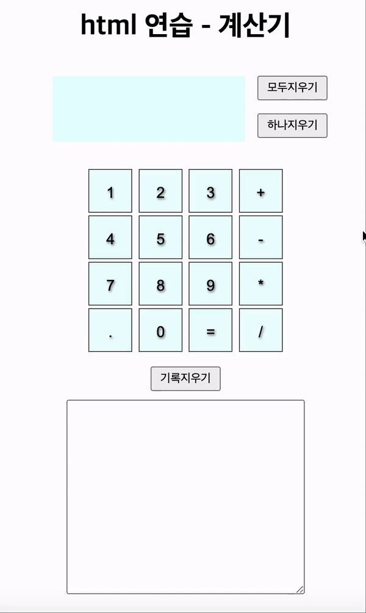

<h1 align="center">HTML+Javascript 사칙연산 계산기</h1>

간단한 사칙연산을 수행한다.
 

 
<h4>보완하고 싶은 것</h4>
<ul>
  

  <li>숫자를 입력 안 하면 alert로 안내문구 띄우기(지금은 0으로 이용)</li>
  <li>자바스크립트 함수 정리... 어떻게 정리해야 더 깔끔할지 잘 모르겠음</li>
  <li>"=" 와 연산자 입력하는 함수를 하나로만 끝내고 싶다</li>
  

</ul>
