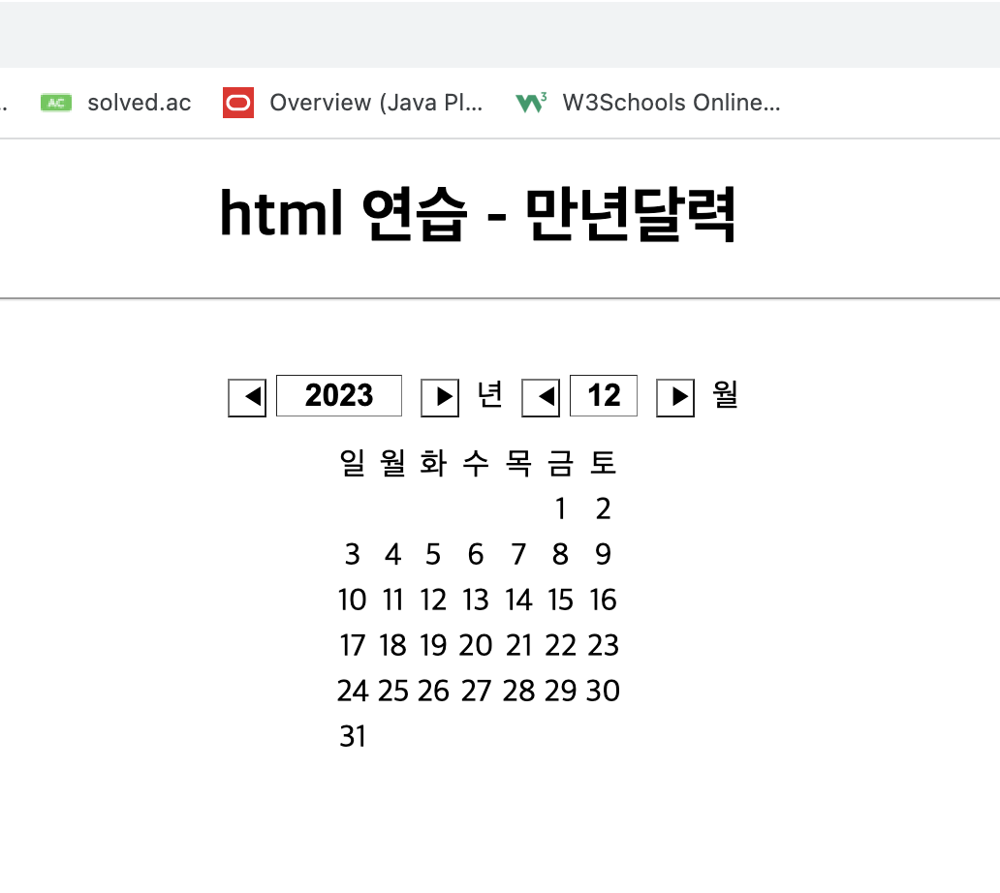
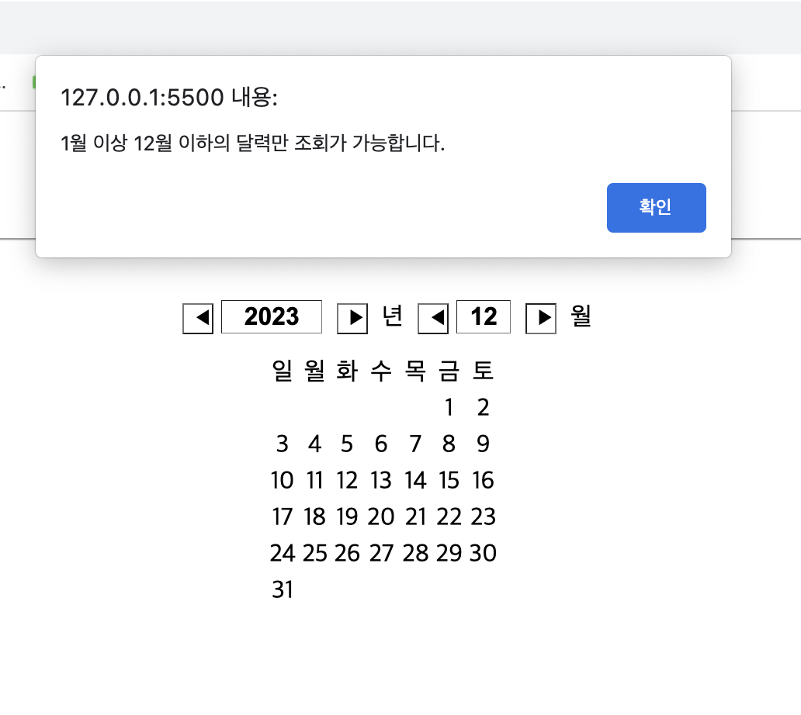
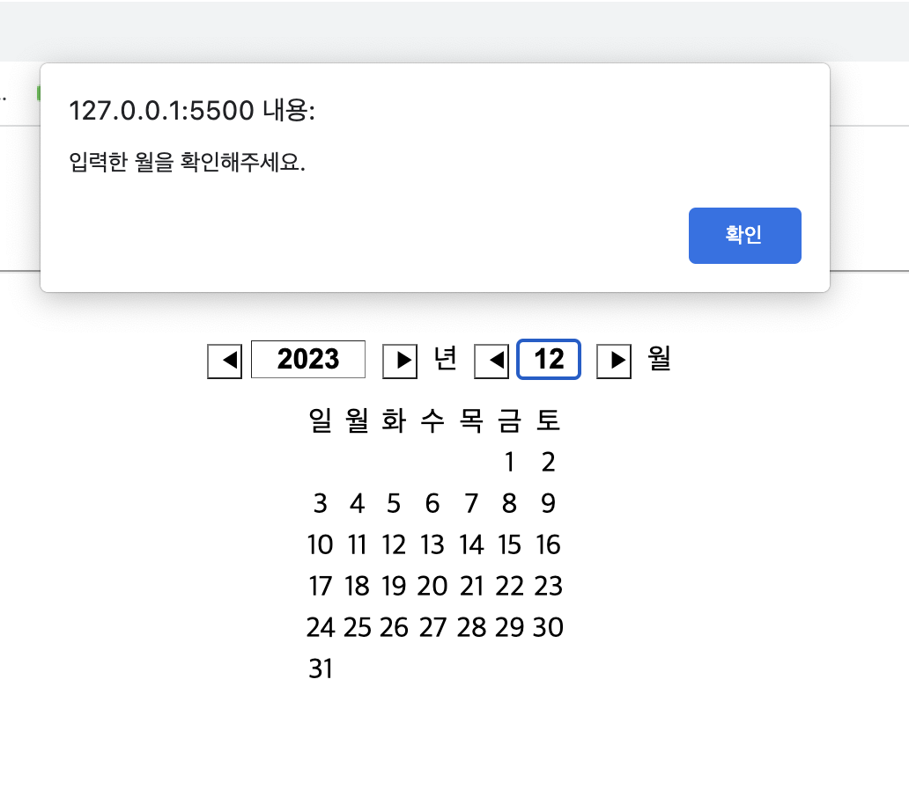
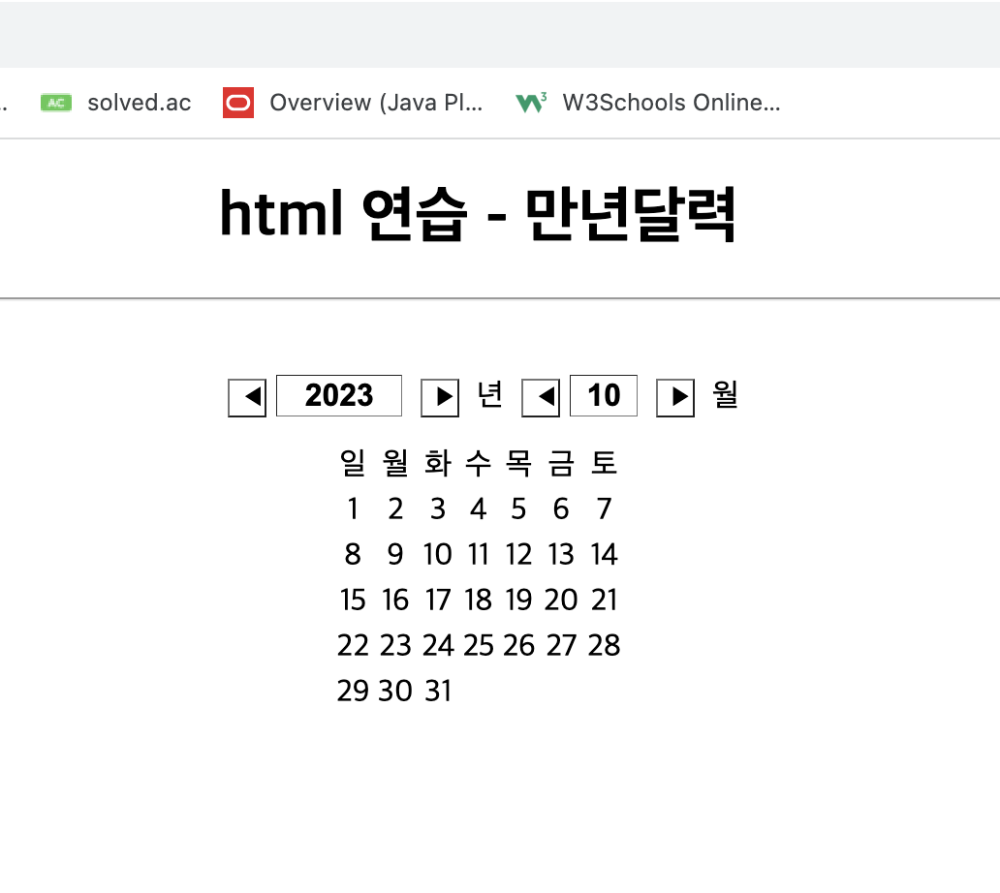

<h1 align="center">HTML+Javascript 만년달력</h1>

특정 년/월 을 입력받아 해당 월의 달력을 출력해준다.

 
초기화면. 시스템 날짜에 맞춰서 년도와 월을 자동으로 설정한다.
 
월을 입력하는 텍스트박스 양 옆 버튼 클릭시 유효성 검사를 진행한다.
 
월을 직접 입력할 때에도 유효성 검사를 진행한다.
 
정상적인 날짜라면 해당 달력을 출력한다.

  
<h4>보완하고 싶은 것</h4>
<ul>
  

  <li>버튼 클릭시 년도 조절 함수 내부에 달력 그리는 함수를 호출하지 않고도 text Element에 신호?를 줄 수 있는지 공부하기</li>
  <li>토요일과 일요일 줄에 컬러 넣기 공부하기</li>
  <li>지금 이 화면(README) 부터 가독성 좋게 수정하고 싶음</li>
  

</ul>

